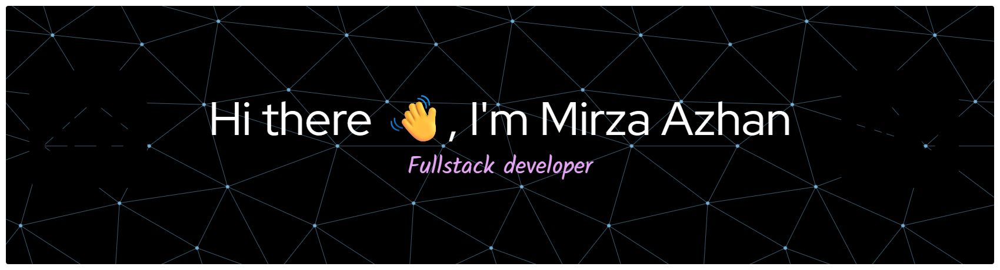

<h3 align="center">💻 Software Engineering Student | University of Malaya</h3>

---

### 👨‍💻 About Me  
🎓 I’m a **final-year Software Engineering student** at the **University of Malaya**, passionate about creating impactful digital solutions through technology.  
💡 My interests span **full-stack web development**, **mobile app development**, and **emerging technologies** like **Blockchain and Web3**.  
📱 I enjoy building applications using **React Native** and **Flutter**, blending great UI/UX with powerful backend systems.  
🌱 Currently exploring how software engineering principles can be applied to build scalable, efficient, and inclusive systems.  
☕ Fun fact: I believe great code starts with great coffee.  

---

### 🧰 Tech Stack  

**Languages:**  

**Frameworks & Tools:**  

---

### 🌟 Featured Projects  

#### 🌐 [Blockchain Charity Platform](#)
> A blockchain-based donation platform built using **Ethereum, React, Node.js**, and **Web3.js** — enabling transparent charitable giving with smart contracts.

#### 🛍️ [MYHeritage E-Commerce Platform](#)
> A **MERN stack** web app promoting Malaysian heritage through digital trade, featuring secure user authentication and dynamic product management.

#### 📱 [HeiKom Community Mobile App](#)
> A **React Native & Firebase** app that enhances community safety and communication through real-time updates and emergency alerts.

#### 🧠 [Sleep Efficiency Prediction Model](#)
> A **machine learning project** that predicts sleep efficiency using Python, Pandas, and Scikit-Learn.

---

### 🌐 Connect with Me  

---

### ✨ Quote I Live By  
> “Code the life you want to debug, not the bugs you want to avoid.”

---

⭐ **Thanks for visiting! Check out my repositories and feel free to collaborate on new ideas or open-source projects.**
